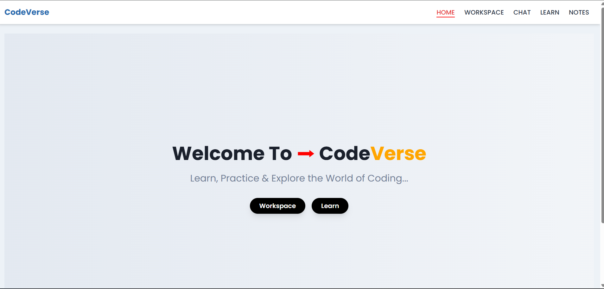
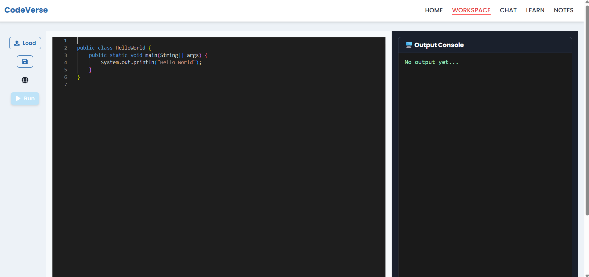
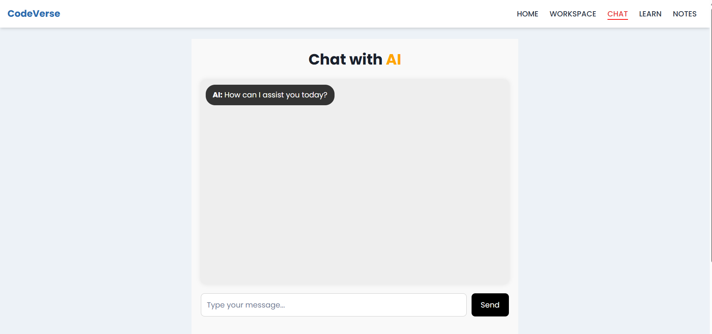
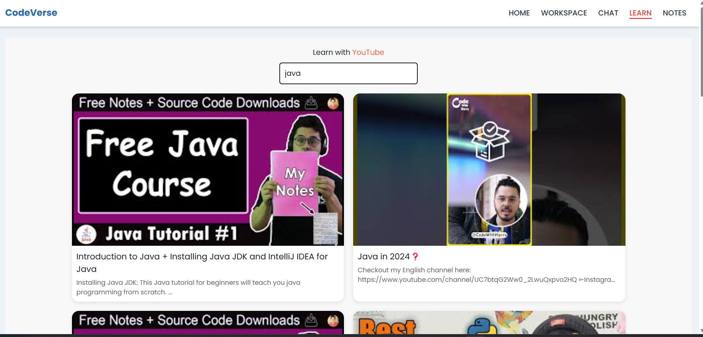
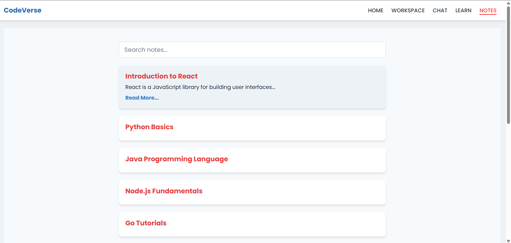

AI integrated MERN Stack platform supporting JavaScript, C++, Java, PHP & TypeScript. All in one Intuitive, Customizable Interface. Ideal for all skill levels, It offers a seamless experience for coding, learning & collaboration.


**Install Dependencies(for both folder)**
   ```bash
npm install

   ```

**To Start**
1. npm run dev (Run this command inside Frontend Folder)
2. npm start (Run this command inside Backend Folder)

*Homepage*
<!--  -->


*Workspace*


*Chat with AI*


*Learn*


*Notes*

